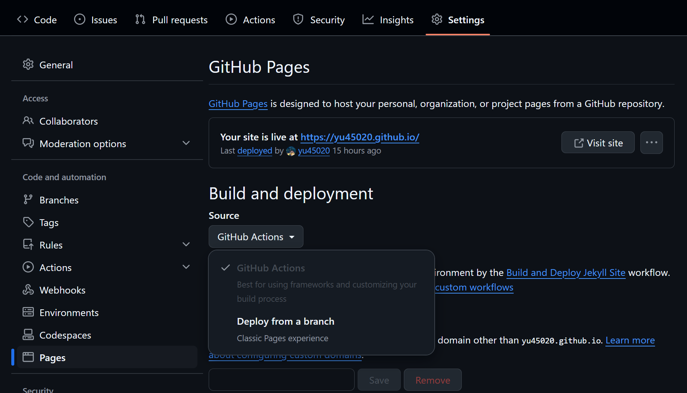
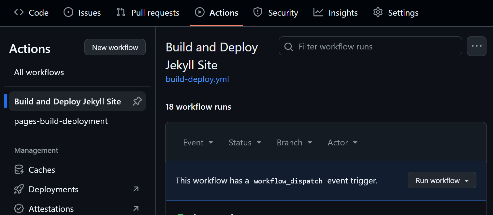
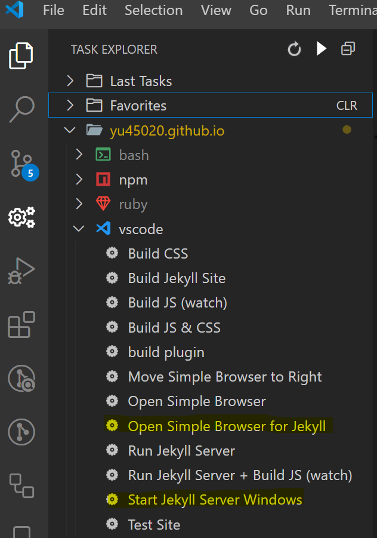
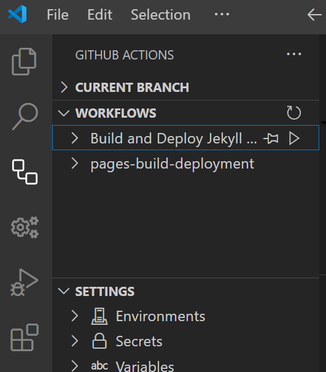

 

 

## TL;DR

* Create a new public repo using your username.

* Download a Jekyll theme:
  * [Minimal Mistakes](https://mmistakes.github.io/minimal-mistakes/), [minimal-light](https://xiao-chenguang.github.io/minimal-light/), [Chirpy](https://chirpy.cotes.page/)
  * [GitHub Pages supported](https://pages.github.com/themes/)
  * [and more...](https://jekyllrb.com/docs/themes/)

* Configure the build process:
  * Go to the repo's `Settings` --> `Pages` on the left panel.
  * Under the `Build and deployment` section, choose `GitHub Actions`.
    * github's default action flow (`Deploy from a branch`) only supports a limited number of themes and only supports `Jekyll` 3.10.0. Some themes may require `Jekyll` > 4.0
  
  

  * Go to the `Actions` tab and set up a new workflow.
  * Copy my [version](https://github.com/yu45020/yu45020.github.io/blob/main/.github/workflows/build-deploy.yml) to your repo folder `.github/build-deploy.yml`.
  * `Run workflow` is available to build and deploy the site manually.
  
  

* Put all markdown documents under the `_posts` folder with the file name pattern `YYYY-MM-DD-title.md`.
  * This theme enables you write a markdown document as usual. Related files are automatically relocated with correct url. 
  * If you use other themes, you may need to check their documentation. You may need to put files in the `assets/` folder or configure the `_config.yml` to include those files into the website build process.

* When you push commits to the main branch, GitHub automatically rebuilds the site.

* If you want to run the site locally:
  * Install `Ruby`, `Bundler`, `Jekyll` [(prerequisites)](https://docs.github.com/en/pages/setting-up-a-github-pages-site-with-jekyll/creating-a-github-pages-site-with-jekyll#prerequisites), or use the docker [method](https://dev.to/cuongnp/setting-up-a-local-development-environment-for-jekyll-with-docker-d8k).
  * Run `bundle install` and `bundle exec jekyll serve --livereload`.
  * The site is available at `http://127.0.0.1:4000/`.

## How to use this theme

Assume you use the [Chirpy](https://chirpy.cotes.page/) theme or this [repo](https://github.com/yu45020/yu45020.github.io) with VS Code.

### Configuration

Configure the `_config.yml` and replace the avatar & favicon images in `assets/img`. Favicon images can be created by [https://favicon.io/](https://favicon.io/). All other files are generated by [https://realfavicongenerator.net/](https://realfavicongenerator.net/).

Install extensions [Task Explorer](https://marketplace.visualstudio.com/items?itemName=spmeesseman.vscode-taskexplorer) and [GitHub Actions](https://marketplace.visualstudio.com/items?itemName=GitHub.vscode-github-actions).

Under the Task Explorer tab, you can find a list of pre-defined tasks under the vscode section. The tasks are defined in `.vscode/tasks.json`. Most tasks come from the `Chirpy` theme. I added the following:

  {:width='300px'}
  
  * `Start Jekyll Server Windows`: start the Jekyll server.
  * `Open Simple Browser for Jekyll`: start the built-in browser, connect to `localhost:4000`, and move to the right panel. You can write the document while viewing the content side by side.

Under the GitHub Actions tab, you can see `Build and Deploy Jekyll Site`. It is defined in `.github/workflows/build-deploy.yml`.

  {:width='300px'} 

  * Trigger the action manually or when a commit is pushed to the main branch.
  * The action builds the site, tests the internal URL, and deploys in GitHub.

### Writing

Organize your markdown documents in `_posts/`. You may use any file name or follow the naming pattern. Files can be standalone or in a separate subfolder. It's easier to organize related images and files under the same subfolder as the document.

A template is available in [`_draft/post_template.md`](https://raw.githubusercontent.com/yu45020/yu45020.github.io/refs/heads/main/_draft/post_template.md).
